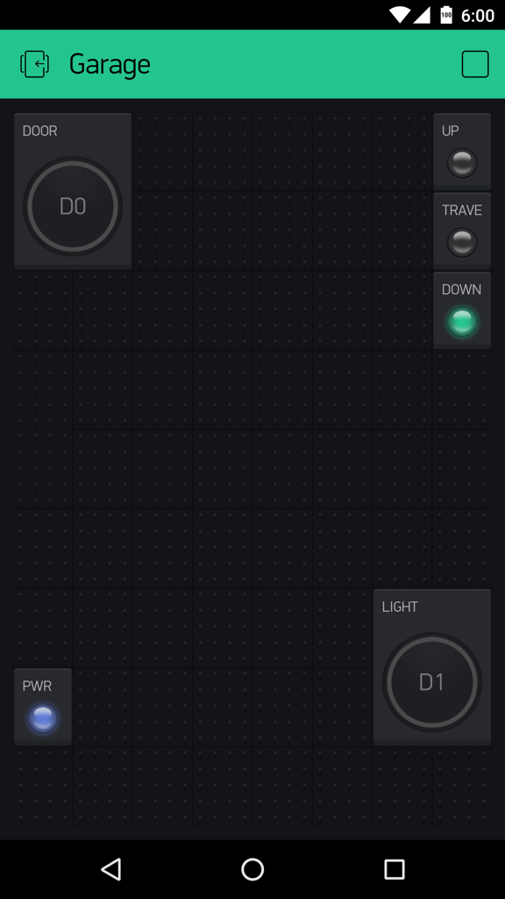
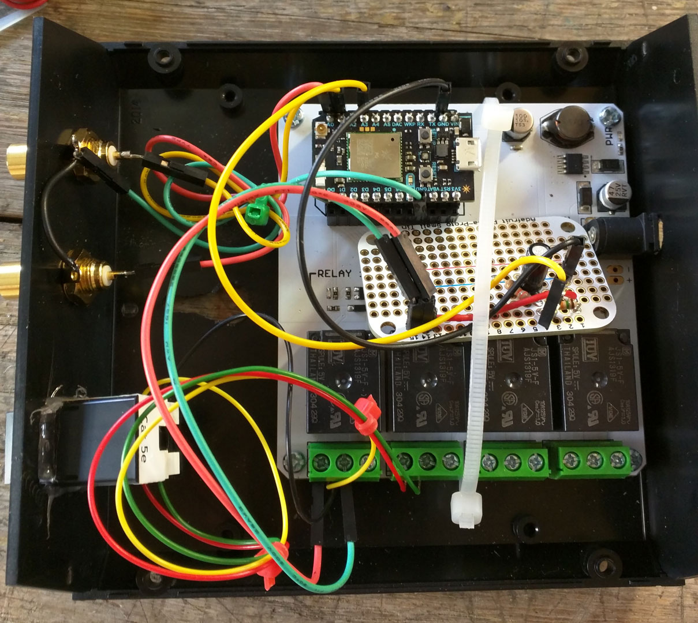
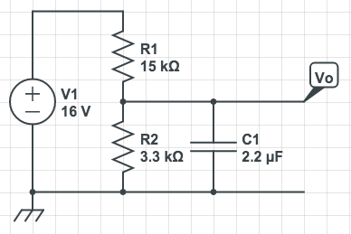

# Garage Door Controller with Particle Photon and Blynk

Because the Timer library is used, the Core won't work with the code as is.

## Sensors
Door: A magnet travels along the upper left corner of the door and activates:
 * pin A0 (digital) - DOOR_UP   - Magnetic reed switch at back of door.
 * pin A1 (digital) - DOOR DOWN -    "      "      "   on front garage wall.

Power detect: A voltage divider and capacitor shift the 15-22 volt pulsing 
signal in the pushbutton wires down to 3.3 V safe levels in order to detect 
when the wall switch cuts power to the garage door.
 * pin A3 (analog) -  DOOR_POWER

## Outputs:
Relays on the [Relay Shield](https://docs.particle.io/datasheets/photon-shields/#relay-shield).

 * pin D0 - Relay 1 - UPDOWN - The main up/down button
 * pin D1 - Relay 2 - LIGHT  - The light button

[Blynk](http://blynk.cc) provides the interface to a smart phone, either iOS or Android.

# Usage
First, get the [particle-cli](https://github.com/spark/particle-cli) tool installed and login
with it.


Compile with:

````
make
````
Except don't, instead copy/paste the .ino file into the web IDE at http://build.particle.io/.

# Blynk

Install the [Blynk](http://blynk.cc) app on your phone, login, and create an interface
page. Drag some buttons and LEDs onto it and hook them up to digital outs and virtual pins.
Extract the authentication token (seen on the nut icon page) and place into a file
named `blynk-auth-token`.  Refer to the example token file.




